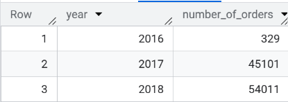
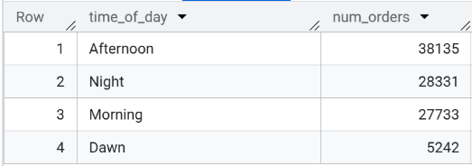
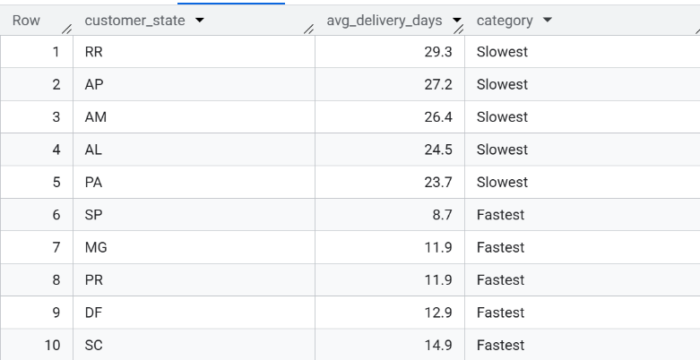

# target-brazil-ecommerce-sql-analysis

## Project Overview
Target is one of the world's leading retail companies, known for delivering value and an exceptional shopping experience. This project analyzes the e-commerce operations of Target Brazil using SQL. The dataset contains approximately 100,000 orders placed between September 2016 and October 2018, providing insights into customer purchasing behavior, sales trends, logistics performance, payment preferences, and regional distribution.

The objective of this analysis is to transform raw transactional data into actionable business insights that can support strategic decision-making and improve operational efficiency.

## Business Problem
As Target expanded its e-commerce operations across Brazil, understanding customer behavior and operational performance became increasingly important. This analysis aims to answer key business questions related to sales growth, seasonality, customer distribution, logistics, delivery performance, and payment behavior to identify opportunities for improving customer experience and business performance.

## Dataset
The dataset contains information on
Customers
Orders
Order items
Payments
Products
Sellers
Reviews
Geolocation

## Business Questions Answered
The analysis focuses on answering the following business questions:

### Exploratory Analysis
- What is the time range of orders in the dataset?
- How many cities and states did customers order from?
### Order Trends
- Is there a growing trend in annual orders?
- Is there monthly seasonality in order volume?
- What time of day do Brazilian customers mostly order?
### Regional Analysis
- How do orders trend month-on-month across states?
- How are customers distributed across Brazilian states?
### Economic Impact
- What is the total and average order value per state?
- What is the total and average freight cost per state?
### Payment Analysis
- Which payment types are used month-on-month?
- How many orders are placed across different installment counts?
  
## Tools Used
Google BigQuery
Github

## SQL Concepts Used
- Joins
- Aggregate Functions
- GROUP BY
- CASE Statements
- Common Table Expressions (CTEs)
- Window Functions
- DENSE_RANK()
- DATE Functions
- DATE_DIFF()
- FORMAT_DATE()

## Key Insights

- Orders grew from 329 (2016) → 45,101 (2017) → 54,011 (2018). A massive scale-up, though growth rate decelerated in 2018
  
  
  
- November 2017 saw a sharp spike from ~3,700 (May) to 7,500+ orders — strong evidence of seasonal demand
- 38,135 orders placed in the afternoon — 7.3× more than the 5,242 placed at dawn. Peak purchase window is 13:00–18:00
  
  
  
- São Paulo (SP) dominates total freight spend at R$718,723 — but pays the lowest average freight at R$15.15 per order
- Roraima (RR) pays the highest average freight at R$42.98 — nearly 3× more than SP
- RR takes 29.3 days on average to deliver vs just 8.7 days for SP — a 3.4× gap in delivery speed
  
  

- Credit card is the dominant payment method across all months; UPI and vouchers are secondary
- 52,546 orders used 1 installment — most customers pay in full; installment usage drops sharply beyond 3

## Business Recommendations

- Strengthen customer retention initiatives through loyalty programs and personalized offers as business growth begins to stabilize
- Prepare inventory, logistics, and promotional campaigns ahead of high-demand periods, particularly during November
- Schedule marketing campaigns and promotional notifications during afternoon hours to maximize customer engagement
- Continue offering multiple payment methods and flexible installment options to enhance customer convenience and encourage higher-value purchases

